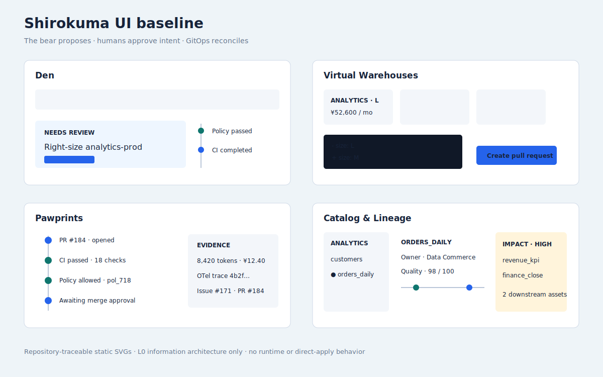
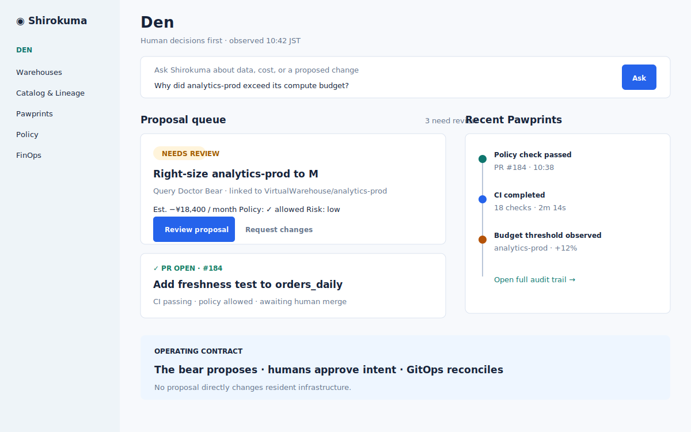
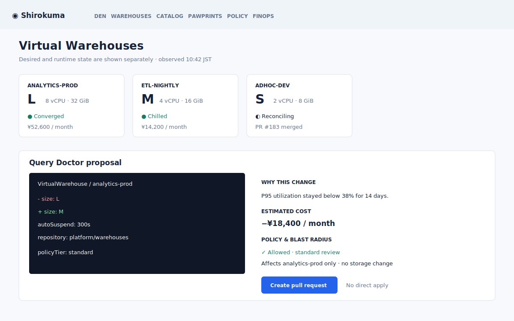
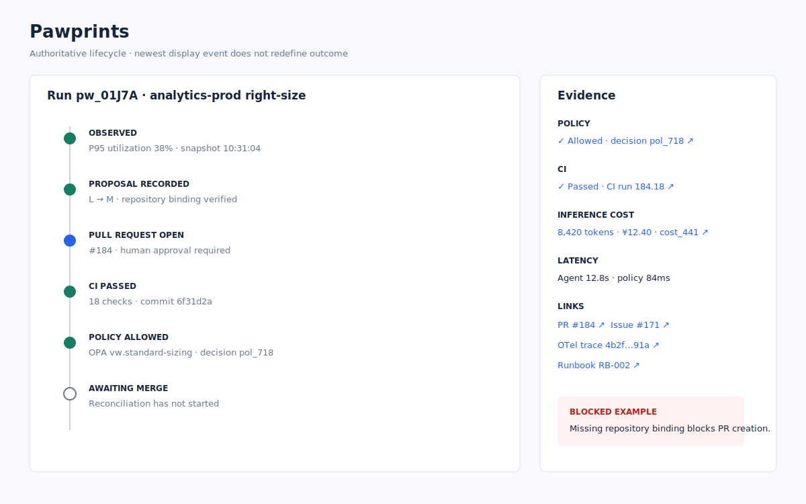
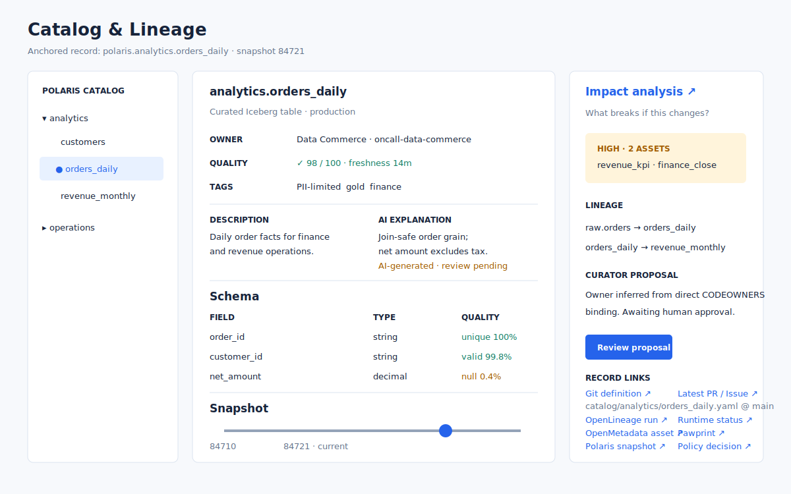

# UI Mockups v0.2.2

## Composite

## Screen 1: Den — Agent Mission Control

Purpose:

- `shirokuma ask` のGUI版として自然言語入力を提供する。
- Agent提案キューを中心に、人間のApprove/Request changes作業を最短化する。
- Pawprintsの直近タイムラインを右側に出し、PR・CI・Policy結果を一目で把握する。

Key design decision:

- ホームはメトリクスダッシュボードではなく、**提案キューと承認の作業面**にする。

## Screen 2: Virtual Warehouse

Purpose:

- XS/S/M/L相当のVirtualWarehouseをカードで表示する。
- Query Doctor Bearの提案を、CRD YAML diffとして提示する。
- CTAは直接適用ではなく **PRを作成**。

Key design decision:

- Snowflake風のwarehouse操作を、ShirokumaのReconciliation Loop原則へ変換する。

## Screen 3: Pawprints — Agent audit timeline

Purpose:

- Agentのobserve → diagnose → plan → PR → CI → policy → mergeの履歴を監査できる。
- OPAでブロックされた危険操作を赤で明示する。
- token count、推論コスト、latency、OpenTelemetry trace、PR/Issueリンクを右ペインに出す。

Key design decision:

- Pawprintは単なるログではなく、AI運用の説明責任インターフェースである。

## Screen 4: Catalog & Lineage

Purpose:

- Polaris / OpenMetadata / OpenLineageの情報を、業務利用者が理解できる形で表示する。
- Iceberg snapshot sliderでtime travelの概念を視覚化する。
- Catalog Curator Bearがowner推定、説明文、影響分析を提案し、承認待ち状態を見せる。

Key design decision:

- カタログ画面は探索画面であり、同時にAIの文脈確認画面である。

## Notes

- このモックはv0.2.2時点の情報設計・ビジュアル方向性を示すための静的画像である。
- 実装時は、画面単位でFigma/Storybook/Playwright visual regressionへ展開する。
- 日本語テキストはプロダクトトーン確認用であり、最終UIでは用語集に合わせて統一する。
- SVGはリポジトリ内で差分レビューできるL0成果物であり、実装用コンポーネントではない。

## Traceability

- Work Package: [WP-L0-UX-001 / issue #5](https://github.com/TommyKammy/Shirokuma/issues/5)
- Interaction model: [113_Interaction_Model.md](113_Interaction_Model.md)
